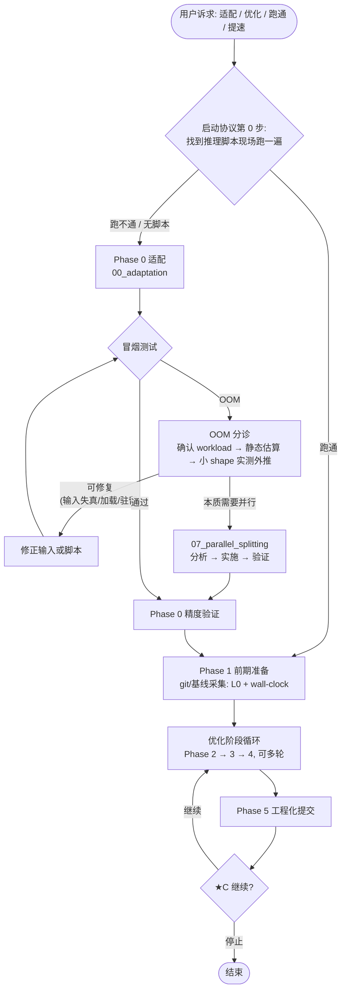

# model_adaptation 与 model_opt 合并方案

> 状态：Draft，待 review
> 日期：2026-08-25

## 1. Summary

将 `model_adaptation` 并入 `model_opt`，成为其第 0 阶段（`00_adaptation`，Phase 0）。适配从"可选的前置 skill"变为全流程的默认入口，已适配模型通过入口判定快速通道直接进入 Phase 1。多卡切分前置判定（OOM 分诊）从 Phase 1 迁移到 Phase 0 的冒烟测试环节，由"代码理解后估算预判"改为"冒烟实测 OOM 触发"，分诊确认本质需要并行后进入 `07_parallel_splitting`，切分完成回归适配精度验证，再进入优化主流程。

## 2. Motivation

当初拆成两个 skill 的前提假设是：**多数模型已经适配好，用户直接做优化**。实际使用情况相反——多数模型并未做过 NPU 适配，用户的第一步诉求就是适配。这导致：

- 适配与优化被切在两个入口，用户需自行判断从哪个 skill 进入，判断依据（模型是否已适配）没有承载位置；
- model_opt 为覆盖"未适配"场景，在自己的 Phase 1 里长出了环境搭建、代码理解等适配职责，与 model_adaptation 形成重叠与触发冲突（见 4.2）；
- 多卡切分前置判定被放在 model_opt Phase 1（基线采集前），但 OOM 的自然暴露点是适配阶段的冒烟测试——适配本来就要跑冒烟，一旦 OOM 就地分诊、就地切分，比在优化流程开头做一轮估算式预判更直接；切分完成后的优化流程（Phase 2+）与切分本身是独立的关注点。

## 3. 需求

### 3.1 约束

- 遵循 Agent Skills 目录规范：单一 `SKILL.md` 入口 + `references/` + `scripts/`（README.md「其他 Agent 框架」节）。
- 合并后仍是**单一顶层 skill**（一个 `SKILL.md` 入口），不再有平行的适配 skill。
- model_opt 现有 `01`–`07` 子技能的内部结构与相对链接尽量不动，控制改动半径与 review 成本。
- 保留现有用户确认节点协议（★A/B/C 与 07 的两个 ★ 节点），合并不改变确认纪律。

### 3.2 目标

- **P0** 适配成为流程第一阶段：未适配模型从 model_opt 同一入口进入，先适配后优化。
- **P0** 多卡切分判定迁移到适配阶段的冒烟测试环节，形成"实测 OOM → 分诊 → 切分 → 回归适配验证"的闭环。
- **P1** 已适配模型可跳过适配直接进入 Phase 1，保留原拆分设计"直接优化"的意图。
- **P1** 消除两个 skill 间的职责重叠（环境准备、代码理解、精度验证脚本、git 初始化）。
- **P2** 仓库文档（README、docs 索引）与实际结构一致。

## 4. 现状

### 4.1 两个 skill 的结构

| | model_adaptation | model_opt |
|---|---|---|
| 定位 | 模型跑通在 NPU 上（适配） | profiling 驱动的性能优化 |
| 阶段 | Phase 1 环境隔离 → Phase 2 权重获取 → Phase 3 推理实现 → Phase 4 精度验证 | Phase 1 前期准备 → Phase 2 瓶颈分析 → Phase 3 优化实施 → Phase 4 门禁验证 → Phase 5 工程化提交（+ 07 并行切分条件轨道） |
| 资产 | `scripts/weight_manager.py`、`scripts/compare_baseline.py`；`references/environment.md`、`references/known_issues.md` | 7 个子技能目录、evidence_db schema、解析脚本体系 |

### 4.2 已存在的割裂与重叠（实证）

| # | 问题 | 证据 |
|---|------|------|
| 1 | **触发词冲突**：两个 skill 都声称覆盖"把模型跑通/适配" | `model_opt/SKILL.md:3` description 含"在昇腾 NPU 上做模型适配与调优时触发"；`model_opt/01_preparation/SKILL.md:1-4` 子技能名为 `npu-adaptation-preparation`，description 含"当用户需要把模型在 NPU 上跑通"。与 `model_adaptation` 的触发条件直接竞争，agent 可能选错入口 |
| 2 | **环境准备重叠**：两处各自维护环境搭建内容 | `model_adaptation/SKILL.md` Phase 1（环境检测与隔离）vs `model_opt/01_preparation/SKILL.md:27-63`（CANN 环境诊断、版本配套、init_device）。references 层面：`model_adaptation/references/environment.md`（版本配套表 + 已知问题，20 行）与 `model_opt/01_preparation/references/environment_reference.md` §4（版本配套确认方法）内容重叠 |
| 3 | **代码理解归属错位**：为写推理脚本服务的代码理解放在优化 skill | `model_opt/01_preparation/SKILL.md:10-24`「一、模型代码理解」——其产出（推理路径、config 架构参数、预处理路径）是适配写推理脚本的前置，不是采集基线的前置 |
| 4 | **精度验证双轨且 baseline 语义未声明** | `model_adaptation` Phase 4（按输出性质选验证策略）、`model_opt/01_preparation/SKILL.md:217-242`（六、精度验证脚本构建）、`model_opt/04_accuracy_assurance`（优化回归验证）三者在两个 skill 里各说一块。两阶段对齐对象不同——**适配对齐迁移前（golden 来自 GPU/CPU 原始实现），优化对齐优化前（NPU 自身输出）**——这一关键差异没有在任何一处声明 |
| 5 | **切分判定位置与判据错位**：分诊放在优化流程开头，依据是估算而非实测；且排查清单混入优化手段 | `model_opt/01_preparation/SKILL.md:129`「第一节代码理解完成后，即可从模型规模与运行需求初判单卡 HBM 是否够用」——此时模型尚未跑通，判定输入只有代码估算；而该节自己也承认触发信号是"代码估算**或运行 OOM**"，OOM 实际发生在跑模型时（即适配冒烟）。同时其 6 项外部因素排查清单（L140-149）中融合注意力、混合精度、碎片整理等过半是优化手段，与适配阶段"最小改动"原则冲突 |
| 6 | **仓库文档失真**：README 与实际结构脱节 | `README.md:7` 及 sparse-checkout 命令只收录 `model_opt`、`opt_explore`，未提及 `model_adaptation`；`README.md:43-64` 目录树仍使用 `02_profiling_analysis/`、"Phase 6" 等过期命名（现为 `02_bottleneck_analysis`、`06_evidence_db`、新增 `07_parallel_splitting`） |

### 4.3 可复用基建评估

- `model_adaptation` 的两个脚本无项目路径耦合，可直接随目录迁移。
- `07_parallel_splitting` 的触发协议已同时支持"分诊触发"和"用户直接触发"（`model_opt/07_parallel_splitting/SKILL.md:12-17`），迁移只需把分诊触发点从 Phase 1 改指向 Phase 0，子技能内部不动。
- 分诊的两个组成件迁移时命运不同：显存预算估算（含 0.8 阈值）**方法不变，但从第二判据升为主判据**；外部因素排查清单**整体解散**（见 5.3）——过半是优化手段，其余各项或属于环境准备已覆盖、或需要跑通才能观察、或本是对用户需求的误判，均不适合作为分诊 gate。

## 5. Gap 与改进方向

### 5.1 Gap 1：流程入口假设错误 —— 适配不是可跳过的前置，而是默认第一阶段

**Gap**：拆分设计假设"模型已适配好、直接优化"，实际多数模型未适配。入口判定（是否已适配）无处承载，用户被迫在两个 skill 间自行选择，且触发词冲突（4.2 #1）会让 agent 选错。

**改进方向**：合并为单一 skill，适配成为 Phase 0，入口判定写进启动协议。合并方向是 `model_adaptation` 并入 `model_opt`（反向不可行：model_opt 拥有子技能编号体系、evidence_db、启动协议、execution_protocol 等骨架，拆散重建成本远高于吸收一个单文件 skill）。

合并后的目录结构：

```
model_opt/
├── SKILL.md                      # 全流程：入口判定 + Phase 0–5 + 确认节点
├── 00_adaptation/                # Phase 0：模型适配（原 model_adaptation 吸收改造）
│   ├── SKILL.md                  # 环境隔离 → 权重获取 → 推理实现 → 冒烟+分诊 → 精度验证
│   ├── references/
│   │   ├── environment.md        # 并入 environment_reference.md 的版本配套部分（去重）
│   │   └── known_issues.md
│   └── scripts/
│       ├── weight_manager.py
│       └── compare_baseline.py
├── 01_preparation/               # Phase 1：瘦身，专注基线采集与脚本体系（见 5.3）
├── 02_bottleneck_analysis/ ... 06_evidence_db/   # 不动
└── 07_parallel_splitting/        # 不动（仅改触发点描述）
```

Phase 编号采用 **Phase 0** 而非全量重编号 01–08：`01`–`07` 的目录名和全部交叉引用（含 `docs/` 下多份文档中的路径）不需要变更，改动半径最小。语义上也成立——Phase 0 是条件执行段，已适配模型跳过它。（**待讨论**：见 7.1）

新的全流程：



与现状相比的关键差异：**切分从 Phase 1 的"前置判定"变成 Phase 0 冒烟的"就地分诊"**；Phase 1 只保留基线采集与脚本构建，不再承担"让模型跑通"的职责。

### 5.2 Gap 1 续：已适配模型的快速通道

**Gap**：合并后若所有模型都强制走完整适配，会退化原拆分的设计意图（已适配模型直接优化）。

**改进方向**：启动协议第 0 步的判定就是**找到推理脚本现场跑一遍**——跑得通即视为已适配，直接进入 Phase 1；跑不通（或根本没有推理脚本）则进入 Phase 0，排障修复直至跑通，这一排障过程本身就在做适配工作。脚本缺失时走完整适配流程（环境 → 权重 → 推理实现）。

不做更复杂的判定条件（如检查精度验证记录、逐项核对产出物）：现场运行是唯一的硬标准，环境漂移、依赖缺失、版本不配套都会在一次真实运行中暴露，任何静态检查都无法替代。

### 5.3 Gap 2：并行切分判定错位 —— 从"优化前的估算预判"改为"适配冒烟的实测触发"

**Gap**：分诊当前位于 Phase 1（`01_preparation/SKILL.md:127-164`），要求"代码理解完成后"即判断，输入是估算；而 OOM 的真实暴露点是运行模型的时候——也就是适配冒烟。位置错位带来两个后果：其一，若用户从 model_adaptation 进入（模型没跑通），OOM 发生在适配阶段，分诊却在另一个 skill 里，agent 流程断裂；其二，优化流程被迫承担"让基线脚本跑得通"的适配职责。

**改进方向**：分诊迁入 `00_adaptation/SKILL.md` 的冒烟测试环节，且**决策树同步重构**——从"外部因素排查清单"改为三条可判定的判据：确认真实 workload → 静态显存预算估算 → 小 shape 实测外推。触发链路：

1. Phase 0 冒烟测试（输出非 None、无 nan/inf、shape 正确）遇到 OOM → **自动进入分诊**，无需用户指令；
2. **Step 1 确认真实 workload**：向用户确认生产环境的序列长度 / batch 形态。它回答两件事：冒烟输入是否失真（冒烟用了远超真实需求的 shape 触发 OOM、按真实 workload 估算放得下 → 换真实 workload 重跑冒烟即可——冒烟的目的是验证正确性，不是压满显存）；以及 Step 2 估算的输入。**用户想跑长序列/大 batch 不是"实现错误"**——它是容量问题的正当输入，直接进估算。
3. **Step 2 静态显存预算估算**（按实际加载的 dtype 数参数字节 + 主导张量/激活峰值，以真实 workload 为输入，纯代码分析 + 算术，分钟级）：
   - **权重常驻本身就超限**（> HBM × 0.8）→ 直接进入切分（第 5 项），**不进入实测**——估算不需要跑模型就能定案，这正是它作为第一判据的价值；权重吃满/超限的模型在此出口分流，Step 3 永远不会遇到"权重放不下"的情形；
   - 估算明显放得下 → OOM 另有原因，进 Step 3；
   - dtype 不一致不需要独立排查项：估算按实际加载的 dtype 计数，若原始 bf16 被默认加载成 fp32，参数字节翻倍会在估算中直接暴露（`from_pretrained` 不带 `torch_dtype` 时确有此坑）；
   - 识别主导张量时**同时记录其缩放规律**（KV cache 类随序列线性、实体化 attention score 类随序列平方），供 Step 3 外推使用。
4. **Step 3 小 shape 实测 + 外推**（条件步骤，仅"估算放得下却 OOM"或边界带时进入——它是估算与实测分歧时唯一的仲裁手段；权重超限在 Step 2 已定案，明显放得下则不会 OOM，两者都轮不到本步）：用小输入跑通并记录 `memory_allocated` 随 shape 的增长曲线，外推到真实 workload——普通运行 + 显存统计，不是 profiler。跑通是前提：驻留、碎片只有跑起来才可见。实测远超估算时，按偏差解释方向检查：`no_grad` 缺失 / 全局引用导致的张量驻留、分配器碎片（`max_memory_allocated` vs `memory_allocated`）。外推放得下 → 用真实 workload 重跑冒烟；放不下或无果 → 判定切分（止损）。
   - **前提由 Step 2 保证**：进入本步意味着估算已确认"权重 + 估算激活放得下"，因此模型必然能加载；实测曲线中常驻部分（权重）是基线偏移、直接测得，可变部分（激活/驻留）才是外推对象。权重占大头的边界带模型同样适用——基线高只压缩剩余空间，不影响分离方法。
   - **外推按 Step 2 识别的缩放规律拟合**（线性 / 平方），不默认线性——对实体化 attention score 的模型做线性外推会系统性低估峰值。
   - **加载阶段即 OOM**（尚未 forward）：显存与 shape 无关，小 shape 实测不适用——按加载路径问题处理（加载期 dtype 中转或临时拷贝导致常驻翻倍），复查无果即切分。
5. 进入 `07_parallel_splitting` 全流程（分析 → 实施 → 验证，含其原有 ★ 确认节点）；
6. 切分验证通过 → 回归 Phase 0 完成适配精度验证（此时验证天然在多卡配置下执行）；
7. 适配完成 → Phase 1 采集**并行基线**（L0 + wall-clock）→ 进入优化主循环。

用户直接报告显存不足/需要多卡时，仍可直接进入 07（原触发方式保留）。

**原排查清单的去向**：现有 6 项外部因素清单（`model_opt/01_preparation/SKILL.md:140-149`）整体解散，各项归位——融合注意力、混合精度/量化、缓冲区复用、碎片整理是**优化手段**，归 Phase 2+ 四维度；dtype 不一致**并入估算**（按实际加载 dtype 计数时自然暴露）；batch/padding"配置不当"多数不是错误而是 **workload 需求**，改为 Step 1 向用户确认；张量驻留**需要跑通才能观察**，并入 Step 3 实测；环境配置在 Phase 0 环境检测步骤**已经完成**，不重复排查。优化阶段若 profiling（`parse_memory_record.py` 等）显示显存冗余，按四维度正常处理；若优化后发现单卡已放得下，07 已有 `disable_parallel()` 回退路径兜底。

**为什么不采用"OOM 即切分、优化完再看"**：切分不是廉价操作——通信 infra、脚本改造、正确性验证（07 全流程 7 步 + 2 个确认节点）成本高，且切分后通信开销混入 profiling 画像，后续所有优化都背着通信税；若事后发现是脚本 bug 或冒烟输入失真，切分完全白做且需回退。相比之下"问需求 + 估算"只需分钟级。成本不对称决定了默认路径是"**问需求 → 估算 → 实测外推 → 无果即切分**"——最后的"无果即切分"就是止损规则：分诊不恋战，三条判据解决不了的问题不在适配阶段死磕。

**外部因素的真实影响面**（为何不必逐项量化）：对参数本身就超 HBM 的大模型，外部因素无关紧要，静态估算直接定案；外部因素只在"参数放得下、激活处于边界"的中等模型上有决定性影响，而这正是小 shape 外推可覆盖的场景。估算主导的流程天然绕开了"每项外部因素影响多大"这个难以预先回答的问题。

**与"自动开启切分"表述的一个差异**（**待讨论**，见 7.2）：建议"自动"止步于**分诊**——分诊无需确认、自动执行；但切分方案实施前保留 07 的 ★ 方案确认节点。理由：切分有 TP/PP/DP 等多种模式和代价权衡，属于需要用户决策的大动作，与"分诊是确定性排查流程"性质不同。

**Phase 1 的对应瘦身**：`01_preparation` 删除「多卡切分前置判定」节，改为一行指引（"单卡放不下/显存问题 → 见 00_adaptation 冒烟分诊与 07_parallel_splitting"）；「一、模型代码理解」「二、环境准备」「三、项目 Git 初始化」随之迁出（归属见 5.4），Phase 1 保留测试数据准备、profiling 采集体系、精度验证脚本构建三节。

### 5.4 Gap 3：两个 skill 间的职责重叠 —— 归属调整表

**Gap**：环境准备、代码理解、精度验证脚本、git 初始化在两侧重复或放错宿主（4.2 #2/#3/#4）。

**改进方向**：按"内容为谁服务"重新归属：

| 内容 | 现位置 | 新位置 | 动作 |
|------|--------|--------|------|
| 环境检测与隔离（Docker/venv 决策、一键启动脚本） | model_adaptation Phase 1 | Phase 0 | 迁入 |
| CANN 诊断、版本配套、init_device 模板 | `01_preparation` 二 | Phase 0（合并两份环境 reference，版本配套表去重） | 迁入 + 合并 |
| 模型代码理解（推理路径、架构参数、预处理） | `01_preparation` 一 | Phase 0，推理实现的前置步骤 | 迁入 |
| git init + .gitignore（权重/profiling 大文件清单不变） | `01_preparation` 三 | Phase 0 开头——适配产出（脚本、环境锁版本）从第一天起就纳入版本管理 | 迁入 |
| 权重获取（weight_manager 四命令） | model_adaptation Phase 2 | Phase 0 | 迁入 |
| 推理实现（配置溯源优先级、最小改动原则） | model_adaptation Phase 3 | Phase 0 | 迁入 |
| 适配精度验证（冒烟 + 按输出性质选策略） | model_adaptation Phase 4 | Phase 0 | 迁入，golden 采集显式成节（见下方双 baseline 说明） |
| 精度验证脚本构建框架（baseline 保存、对比脚本要求、确定性条件） | `01_preparation` 六 | Phase 1 保留——它服务优化回归（04_accuracy_assurance 消费），与 Phase 0 的适配验证互相链接并声明分工（见下方双 baseline 说明） | 保留 + 加分工声明 |
| 测试数据准备 | `01_preparation` 四 | Phase 1 保留（性能测试集、L1 样本为优化服务）；Phase 0 的精度验证样本复用其「覆盖性检查清单」，链接引用不复制 | 保留 + 链接 |

**双 baseline 说明（分工声明的核心）**：两个阶段的"精度验证"名字相同，但**对齐对象不同**：

- **Phase 0（适配/迁移）对齐迁移前**：golden 值来自在 GPU（优先）或无 GPU 时的 CPU 上运行原始实现的输出，用 `compare_baseline.py` 与 NPU 输出做数值对齐（cosine / max_abs；工具本身在 CPU 上比对，与 golden 采集设备无关）。因此 Phase 0 需要一个**外部 golden 采集步骤**——原 model_adaptation 中这一步隐含在 compare_baseline.py 的用法里，改造后在 `00_adaptation` 中显式成节：在哪台机器、什么配置下跑原始实现、输出如何落盘。
- **优化阶段（Phase 1 保存 baseline，04_accuracy_assurance 消费）对齐优化前**：baseline 是 NPU 上优化前的自身输出，每轮优化只回答"有没有退化"，不依赖 GPU/CPU golden。

两者的关系是单向的：Phase 0 通过 golden 确认"NPU 上的初始实现正确"，此后优化阶段的所有回归都以这个已确认正确的输出为基准——这也是优化阶段可以不依赖外部 golden 的前提。

### 5.5 Gap 4：仓库文档失真

**Gap**：README 未收录 `model_adaptation`，目录树命名过期（4.2 #6）。

**改进方向**：合并本身消除"是否收录 model_adaptation"的问题；README 的目录结构、sparse-checkout、软链接说明随合并一次性更新为现状（含 `00_adaptation`、`02_bottleneck_analysis`、`06_evidence_db`、`07_parallel_splitting`），消除积压的命名漂移。

## 6. 改动清单

> **实施修订（2026-08-25）**：按 review 反馈调整——① `environment_reference.md` 整体随迁至 `00_adaptation/references/`（迁移后唯一消费方就是 Phase 0），且在 SKILL.md 中只在 0.1 引用一次；② `known_issues.md` 删除，其中无法从模型文档推导的 3 条精度坑（VAE fp16、interpolation、flash_attention 兼容性）与 upcast 定位流程并入 `environment_reference.md` §5，低价值配置类条目丢弃；③ 「双 baseline 语义」独立章节移除，golden 语义一句话内联到 0.5；④ 标准项目目录结构（含 `comparison_records/`）上移至 `references/standardized_operations.md` 作为跨 Phase 统一规范，`05_engineering` 的 gitignore 模板对齐之；⑤ 顶层 SKILL.md 的「多卡切分集成」章节删除（handoff 细节归属 00 的分诊节与 07 的流程位置节，消除三处冗余），`set_env.sh` 生成覆盖三种隔离方案；⑥ 01_preparation 测试数据重构为双轨：性能数据按"性能 regime 质变"覆盖（每 regime 1 条、总量几条、稳定性靠重复测量），精度数据按正确性风险覆盖，消除与 profiling_collection.md「重复 ≥20 次取中位数」的口径冲突。

| 文件 | 改动 |
|------|------|
| `model_opt/00_adaptation/`（新增） | 由 `model_adaptation/SKILL.md` 改造：frontmatter 改为子技能命名；新增冒烟分诊节（决策树重构为"确认 workload → 静态估算 → 小 shape 实测外推 → 止损切分"，原排查清单解散归位，见 5.3）；精度验证节显式化 golden 采集（GPU 优先，无 GPU 用 CPU，含落盘要求）；scripts/ 与 references/ 随迁 |
| `model_adaptation/`（删除） | 内容全部迁出后移除目录 |
| `model_opt/SKILL.md` | 启动协议增加第 0 步「适配状态判定：找到推理脚本现场跑一遍，跑通即跳过 Phase 0」；全流程图增加 Phase 0 与分诊分支；description 合并适配触发词；子技能索引表增加 00_adaptation 行；「多卡切分集成」节触发位置 Phase 1 → Phase 0 |
| `model_opt/01_preparation/SKILL.md` | 删除一、二、三节与「多卡切分前置判定」节（改为指引链接）；frontmatter description 收窄为基线采集与脚本构建 |
| `model_opt/07_parallel_splitting/SKILL.md` | 触发位置描述从 Phase 1 分诊改为 Phase 0 冒烟分诊（两处：正文与「在 model_opt 流程中的位置」）；同步修正「分诊已排除外部因素」的表述——分诊现在完成的是容量判定与可修复项（输入失真/加载/驻留）识别，显存冗余类优化留给优化阶段 |
| `model_opt/01_preparation/references/environment_reference.md` | 吸收 `model_adaptation/references/environment.md` 的版本配套表与已知问题，去重 |
| `README.md` | 目录结构、sparse-checkout、软链接命令更新为合并后结构 |
| `docs/README.md` | 索引新增本方案目录（本次随方案提交） |

改动不涉及：`02`–`06` 子技能内容、evidence_db schema、所有解析脚本。

## 7. 待讨论问题

1. **Phase 编号**：Phase 0（改动最小，`01`–`07` 及历史文档路径全部不动）vs 全量重编号 01–08（编号语义更顺，但需同步修改所有交叉引用与 `docs/` 历史文档中的路径）。本方案推荐前者。
2. **切分的自动化程度**：分诊自动触发已无异议；切分方案实施前的 ★ 确认节点是否保留。本方案建议保留（切分是多方案权衡的大动作），若希望"发现 OOM 即全自动切完"，07 需要增加方案自动选择规则，改动量另计。
3. **顶层 skill 命名**：目录名 `model_opt` 保持不变（外部软链接不破坏）；frontmatter `description` 合并适配触发词无异议；`name: npu-model-optimization` 是否改为更能涵盖"适配+优化"的名字（改名会影响已按 name 加载的存量用户）。

## 8. 已识别的远期问题（不在本轮）

- evidence_db 是否扩展适配阶段记录（适配案例、环境问题沉淀），当前 schema 仅覆盖优化案例。
- 07 与 Phase 0 的 handoff 中 `parallel_splitting` 字段的记录时机在迁移后需实测校验（协议文字已覆盖，实际执行顺序变化）。

## 9. 关联文档

- `docs/parallel_splitting_capability/2026-08-21/parallel_splitting_general_analysis.md` — 并行切分能力设计（07 的方法论来源，本方案不改动其内容）
- `docs/parallel_splitting_capability/2026-08-18/CHANGELOG.md` — 07 子技能新增说明（其触发点描述将随本方案变更）
