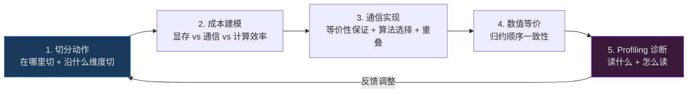
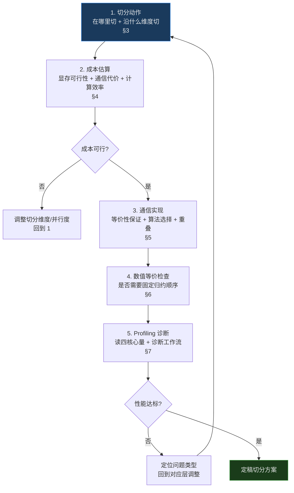

# 并行切分通用分析：动作原理、成本建模、通信设计与性能诊断

> **一句话定位**：从分布式系统第一性原理出发，将并行切分从"模型家族特化规则"抽象为"切分动作→成本量化→通信实现→性能诊断"的闭环方法论，输出可指导任意模型架构的通用分析框架。
>
> **生成日期**：2026-08-21 | **视角**：分布式系统设计者 | **类型**：方法论 + 领域全景调研

---

## 执行摘要

- **切分的两个基本动作**：一切切分只做两件事——决定"在哪里切"（层/模块间 vs 算子内）和"沿什么维度切"（可切维 vs 归约维）。TP/PP/DP/EP/CP 全部可归约为这两个动作的不同组合，不存在独立的"第六种并行"。
- **成本可建模为三目标权衡**：显存占用 $M$、通信代价 $T_{comm}$、计算效率 $\eta_{compute}$ 构成切分代价空间。显存按增长驱动因素分为参数比例状态（参数/梯度/优化器）和 workload 比例状态（激活/持久运行状态），用 placement 语义（replicated/sharded/materialized/offloaded）可从切分方案直接推导显存和通信，无需试运行。训练与推理的差异仅在"哪些状态存在"和"哪个占主导"（训练切优化器、推理切持久运行状态）——同一套公式和可行性判据适用两者。"OOM 后找切法"是被动策略，基于成本模型的主动估计可在运行前排除大部分次优配置。
- **通信实现遵循"先正确后高效"的设计层次**：第一层保证数学等价（切归约维后必须用集合通信聚合部分和），第二层在等价的通信方案中选择更优算法（算法分析的方法论是 $T = S \cdot \alpha + D \cdot \beta$，延迟下界 $\Omega(\log p)$ 与带宽下界 $\Omega(\frac{p-1}{p} M)$ 不可同时达到，因此不存在全局最优算法，只有按消息大小和拓扑选择的权衡点），第三层做通算重叠（可结合律是重叠的充要条件）。
- **数值等价性是切分的隐性约束**：浮点非结合性使得不同切分方案和通信归约顺序产生不同数值结果。训练场景误差累积有限，推理/RL 场景需额外保障——已有 TBIK 等工作通过固定归约顺序实现跨 TP size 的逐位一致。
- **Profiling 诊断有通用的读法**：不论平台（Nsight/msprof/PyTorch Profiler），核心是读四个量——通信占比、Not-Overlapped 通信、带宽利用率、空闲气泡——它们分别对应切分过度、重叠不足、链路次优、调度失配四类问题，形成从 profiling 到切分调整的诊断闭环。

---

## 1. 背景与定位

### 1.1 为什么需要一份架构无关的切分分析

现有并行技术分析大多围绕 Transformer 的 attention/FFN/LayerNorm 结构展开。当遇到 CNN、Diffusion U-Net、Mamba/RWKV 等 SSM、GNN、多模态塔式结构或任意新型混合架构时，"attention 后 AllReduce""FFN 列并行"这类规则不再直接适用。

但底层规律不变：切分的代价只由"算子如何归约"与"张量沿哪维切"决定，与模型家族无关。本报告将这一抽象提炼为四个层面的通用分析框架——动作原理、成本建模、通信设计、性能诊断——并补充数值等价性这一常被忽视的隐性约束。

### 1.2 分析范围

| 维度 | 覆盖 | 说明 |
|------|------|------|
| 切分动作原理 | ✅ | 两动作分类法，统一 TP/PP/DP/EP/CP |
| 成本建模 | ✅ | 三目标权衡 + placement 语义推导 |
| 通信设计原则 | ✅ | 等价性保证 + 算法选择 + 重叠判据 |
| 数值等价性 | ✅ | FP 非结合性对切分的影响 |
| Profiling 诊断 | ✅ | 跨平台通用读法 |
| 具体框架代码 | ❌ | 见同目录其他报告 |
| 某一硬件特化 | ❌ | 跨平台通用，昇腾/GPU 作为实例引用 |

---

## 2. 全景概览：切分分析闭环

切分不是一次定稿的静态决策，而是一个从"需求驱动切分"到"profiling 验证反馈"的闭环。本报告沿此闭环组织：



**关键发现**：

- **切分动作可归约为两个决策**，一切并行策略都是这两个决策在"算子语义"和"计算图拓扑"约束下的实例。
- **成本可从 placement 语义直接推导**，无需运行——这使配置空间搜索从"试错"变为"剪枝"。
- **通信设计有三层**，正确性是第一性约束，效率是第二性优化，两者不可混淆。
- **Profiling 的四个核心量**构成诊断骨架，跨平台通用。

---

## 3. 切分动作原理：在哪里切与沿什么维度切

### 3.1 两个基本动作

一切并行策略可分解为两个正交决策：

| 决策 | 选项 | 决定什么 |
|------|------|---------|
| **在哪里切** | 层/模块间切 / 算子内切 | 切分粒度与通信频率 |
| **沿什么维度切** | 可切维 / 归约维 | 是否引入通信、引入什么通信 |

这两个决策的组合产生一切已知并行策略：

| 在哪里切 | 沿什么维度切 | 通信原语 | 对应并行 |
|---------|------------|---------|---------|
| 层/模块间（整层分配） | 深度维（层间） | P2P Send/Recv | **PP** |
| 不切模型（切数据） | batch 维（可切） | 无 | **DP** |
| 层/模块间（独立分支分配） | 分支维（可切） | AllToAll | **EP** |
| 算子内（拆权重矩阵） | 输出维（可切） | AllGather（拼接输出切片） | **TP（列并行）** |
| 算子内（拆权重矩阵） | 输入维（归约） | AllReduce（部分和求和） | **TP（行并行）** |
| 算子内（拆激活） | 归约维 | AllGather + ReduceScatter | **SP** |
| 算子内（拆激活/状态） | 序列维（长归约轴） | 环形 P2P | **CP** |

> **核心定理**：切一个维度引入计算通信，当且仅当存在某个算子沿该维归约。切可切维零计算通信（各卡独立计算；输出分片后消费方需要完整张量时一次 AllGather 还原——属还原通信，非计算通信），切归约维必然引入集合通信，且通信原语由算子类型决定。

### 3.2 "在哪里切"：粒度与频率的权衡

**层/模块间切**把整层或整个模块分配到不同设备。通信发生在分界处，频率低，但每层/模块完整在一卡上。代表是 PP（沿深度切层）和 EP（沿分支切专家模块）。DP 不属于此类——它不切模型，复制完整模型并切数据，零通信。

**算子内切**把单个算子的权重或激活沿某维度拆到多卡——算子是模型结构的最小单元，只有这一类真正切到其内部（对其计算做数学分解）。通信发生在算子执行中，频率高（每层每步），但单卡只持部分权重。代表是 TP（切权重矩阵）和 SP（切归约维激活）。通信代价是高频集合通信（AllReduce/AllGather+ReduceScatter）。

二者的权衡本质上是一个**通信频率 × 每次通信量**的乘积问题：

$$T_{comm\_total} = \underbrace{f_{comm}}_{\text{通信频率}} \times \underbrace{T_{per\_comm}(M, \alpha, \beta)}_{\text{单次通信代价}}$$

- 层/模块间切：$f_{comm}$ 低（每 micro-batch 或每步一次），$T_{per\_comm}$ 视链路
- 算子内切：$f_{comm}$ 高（每层每步），$T_{per\_comm}$ 由 AllReduce/AG+RS 成本决定

> **设计判据**：当模型层数多、单层计算重时，算子内切（TP）的 AllReduce 代价可被层间计算掩盖；当层数少或单层计算轻时，高频 AllReduce 反成瓶颈，应优先用层/模块间切（PP）或不切模型（DP）。

### 3.3 "沿什么维度切"：可切维 vs 归约维

一个张量的每个维度对算子而言有两种角色：

- **可切维（shardable）**：算子在该维上独立计算（逐元素或逐样本），切开后各卡独立、零通信。如 batch 维对大多数算子、元素级算子的任何非归约维。
- **归约维（reduction）**：算子在该维上做聚合（求和、归一化、softmax 分母、池化），切开后必须通信才能完成聚合。如 LayerNorm 的 hidden 维、softmax 的 seq 维、全连接的输入特征维。

**判断方法**：对任意算子 $f$ 和维度 $d$，检查 $f$ 的计算是否沿 $d$ 跨元素聚合。若 $f(x) = g(x_1, x_2, \ldots, x_n)$ 其中 $g$ 是聚合函数（sum/max/mean），则 $d$ 是归约维，切它必引入通信。否则 $d$ 是可切维。

### 3.4 算子类型决定通信原语

不论模型架构，任意算子可归入以下类别，每类在不同切法下的通信是确定的：

| 算子类 | 典型例子 | 切可切维 | 切归约维 | 切线性算子输出维 | 切线性算子输入维 |
|-------|---------|---------|---------|----------------|----------------|
| **元素级** | ReLU/SiLU/残差加/dropout | 无通信 | — | — | — |
| **线性** | Linear/Conv/einsum/矩阵乘 | 无通信 | — | AllGather（列并行） | AllReduce（行并行） |
| **归约** | sum/LayerNorm/softmax/池化 | 无通信 | AG+RS / AllReduce | — | — |
| **拼接** | torch.cat/stack | AllGather | — | — | — |
| **拆分** | chunk/split | ReduceScatter | — | — | — |
| **跨界转置** | 交换分片维的 permute | AllToAll | — | — | — |
| **分支派发** | MoE 路由/多头/CFG/条件计算 | AllToAll | — | — | — |
| **递归状态传递** | RNN/SSM 步、Ring Attention | P2P 环形 | — | — | — |

这张表架构无关：CNN 的卷积是线性算子（切输出通道维→AllReduce，与 Linear 列并行同构），GNN 的消息聚合是归约算子（切节点维→AllReduce），Mamba 的选择性扫描是递归状态传递（切段→环形 P2P）。

### 3.5 计算图拓扑约束切分位置

单算子通信确定后，整体图结构进一步约束可行的切分方案：

- **链式（sequential）**：层间串行依赖 → 深度可切，对应 PP。代价是流水气泡。
- **独立分支（parallel branches）**：多条互不依赖支路 → 各支路分卡，对应 EP 泛化。通信是入口+出口 AllToAll。
- **共享主干+分支（trunk+branches）**：主干共享、分支按路由选择 → MoE 范式，EP。
- **重复块（repeated blocks）**：同结构反复堆叠 → 块内 TP/SP、块间 PP、块内维 DP。
- **长程归约（long-range reduction）**：某算子沿极长轴归约 → 该轴可切，环形传状态，对应 CP。

### 3.6 统一视角：不存在独立的"第六种并行"

上述分析表明，所有并行策略都是"在哪里切 × 沿什么维度切"在算子语义和图拓扑约束下的实例化。当遇到新架构时，不需要问"这是什么并行"，而应问：

1. 这个张量有哪些维度？哪些是归约维？（→ §3.3）
2. 切它会引入什么通信？（→ §3.4 查表）
3. 整体图是什么拓扑？（→ §3.5）
4. 切在哪——层/模块间还是算子内？（→ §3.2 权衡频率与代价）

这四步给出正确且不退化的切分基线。Transformer 只是这条规则的一个特例：attention/FFN 是线性算子（→TP），LayerNorm/Softmax 是归约（→SP），MoE 是分支派发（→EP），长序列是长归约轴（→CP）。

---

## 4. 切分成本建模：从"OOM 后找切法"到"运行前主动估算"

### 4.1 为什么需要成本模型

实践中最常见的切分决策路径是"试运行 → OOM → 换一种切法 → 再试"。这有三个问题：① 试运行代价高（大模型编译+初始化数分钟）；② 配置空间巨大（$N = p_{tp} \times p_{pp} \times p_{dp} \times \ldots$），盲搜不可行；③ OOM 只反映显存约束，不反映通信代价，换的切法可能解决了显存但引入了通信瓶颈。

成本模型的目标是：**在运行前从切分方案推导出显存需求、通信代价和计算效率，用以剪枝配置空间、定位帕累托前沿。**

### 4.2 三目标代价空间

切分方案的成本可建模为三个目标的权衡：

$$\text{Cost}(\text{plan}) = \big(\; M_{\text{per\_device}}(\text{plan}),\;\; T_{\text{comm}}(\text{plan}),\;\; \eta_{\text{compute}}(\text{plan})\; \big)$$

| 目标 | 含义 | 越小越好？ | 约束关系 |
|------|------|-----------|---------|
| $M_{\text{per\_device}}$ | 单卡显存占用（参数+梯度+优化器+激活+状态） | 是，受限于卡显存上限 $M_{\max}$ | 切分越多越小 |
| $T_{\text{comm}}$ | 单步通信总时间（考虑重叠后） | 是 | 切归约维越多越大 |
| $\eta_{\text{compute}}$ | 计算利用率（实际算力 / 峰值算力） | 是 | 切分引入气泡和通信→降低 |

三者存在固有张力：切分降低 $M$ 但增大 $T_{comm}$ 并可能降低 $\eta$。不存在三者同时最优的方案——这是"没有银弹"的形式化表述。

### 4.3 显存模型：按增长驱动因素分类

#### 4.3.1 两类显存状态

一切模型在设备上的显存占用可按**增长驱动因素**分为两类——这个分类与模型架构无关：

| 类别 | 大小由什么决定 | 包含哪些状态 | 是否随 workload 变化 |
|------|-------------|------------|-------------------|
| **参数比例状态** | 参数量 $P$ | 参数权重（训练还含梯度、优化器状态） | 否，固定 |
| **workload 比例状态** | batch / 序列长 / 分辨率 / 图大小 等 | 激活（前向中间值），以及推理时的持久运行状态 | 是，随负载线性或超线性增长 |

"持久运行状态"是推理特有的——它是跨前向步骤需要保留的状态，**具体是什么取决于架构**：

| 架构 | 持久运行状态 | 沿什么维增长 |
|------|------------|------------|
| Transformer（自回归推理） | KV cache | 序列长 × 层数 |
| RNN / SSM（Mamba/RWKV） | 隐藏状态 $h_t$ | 序列/时间步长 |
| GNN | 节点特征表 | 节点数 |
| Diffusion（逐步去噪） | 当前步激活 | 分辨率 × 通道 |
| CNN / MLP（无状态推理） | 无 | — |
| 任意自回归/序列模型 | 跨步骤传递的状态 | 序列长 |

> **关键抽象**：不需要知道持久状态叫什么名字——只需要知道"它是否存在"和"它沿什么维增长"。识别了增长维，就知道切哪个维度能降显存（§3 的"持久状态沿其增长维切"原则）。

#### 4.3.2 训练显存公式

设参数量为 $P$，每参数字节数为 $b_p$（BF16 = 2），梯度字节数 $b_g$（BF16 = 2），优化器系数 $k_{opt}$（Adam 混合精度 = 12：FP32 master 4B + $m$ 4B + $v$ 4B），激活字节数 $M_{act}$，并行度为 $p$。

每参数总字节 = $b_p + b_g + k_{opt} = 2 + 2 + 12 = 16$。7B 模型：$7 \times 10^9 \times 16 = 112$ GB。

| 方案 | 参数 | 优化器 | 梯度 | 单卡显存 |
|------|------|--------|------|---------|
| 纯 DP | replicated | replicated | replicated | $P \cdot (b_p + b_g + k_{opt}) + M_{act}$ |
| ZeRO-1 | replicated | **sharded** | replicated | $P \cdot (b_p + b_g) + \frac{P \cdot k_{opt}}{p} + M_{act}$ |
| ZeRO-2 | replicated | **sharded** | **sharded** | $P \cdot b_p + \frac{P \cdot (b_g + k_{opt})}{p} + M_{act}$ |
| ZeRO-3 / FSDP | **sharded** | **sharded** | **sharded** | $\frac{P \cdot (b_p + b_g + k_{opt})}{p} + M_{act}^{ag}$ |
| TP | **sharded** | 视叠加 | **sharded** | $\frac{P \cdot (b_p + b_g + k_{opt})}{p_{tp}} + \frac{M_{act}}{p_{tp}}$ |
| PP | **sharded** | 视叠加 | **sharded** | $\frac{P \cdot (b_p + b_g + k_{opt})}{p_{pp}} + \frac{M_{act}}{p_{pp}}$ |

其中 $M_{act}^{ag}$ 表示 FSDP 前向 AllGather 时临时物化完整参数的峰值（按层而非全模型 AllGather 控制）。TP/PP 的"视叠加"指优化器状态可叠加 ZeRO 分片，此时除以 $p_{tp} \times p_{zero}$。

> **关键洞察**：ZeRO-3 用 1.5× 的通信量换取了 8× 的显存节省（相对纯 DP），与原始 ZeRO 论文结果吻合。placement 语义的推导能力使其可作为切分方案的成本估计器，无需运行。

#### 4.3.3 推理显存公式（架构无关）

推理无梯度、无优化器。显存由两类状态组成：

$$M_{\text{per\_device}} = \frac{M_{param}}{p_{param}} + \frac{M_{state}}{p_{state}} + \frac{M_{act}}{p_{act}} + M_{overhead}$$

其中 $M_{state}$ 是持久运行状态的显存，其值取决于架构：

- **有持久状态的架构**（Transformer/RNN/GNN/自回归）：$M_{state} > 0$，随 workload 增长
- **无持久状态的架构**（CNN/MLP 单次前向）：$M_{state} = 0$，$M_{act}$ 是唯一 workload 比例项

**参数显存**（所有架构通用）：$M_{param} = P \times b_p$

**持久运行状态显存**（架构相关，但公式结构统一）：$M_{state} = c \times \text{workload\_dim}$，其中 $c$ 是每单位 workload 的字节数，workload\_dim 是增长维度（序列长 / 节点数 / 分辨率 等）。

| 切分方案 | $p_{param}$ | $p_{state}$ | $p_{act}$ | 说明 |
|---------|-----------|------------|----------|------|
| 纯 DP/replica | 1 | 1 | 1 | 每卡完整副本 |
| TP（切权重输出维） | $p_{tp}$ | $p_{tp}$（若状态与 head 维绑定） | $p_{tp}$ | 权重和状态同时分片 |
| PP（切深度） | $p_{pp}$ | $p_{pp}$（状态按层分布） | $p_{pp}$ | 每段只存自己层的状态 |
| CP（切状态增长维） | 1 | $p_{cp}$ | $p_{cp}$ | 专门切持久状态，不切参数 |
| EP（切分支） | $p_{ep}$ | 1 | 1 | 切分支参数，状态不分片 |

> **设计判据**：推理切分的首要目标是切占主导的显存项。当 $M_{state}$ 占主导（长序列/大图/高分辨率推理）→ 优先用 CP（切状态增长维）或 TP/PP（同时切参数和状态）。当 $M_{param}$ 占主导（模型大但 workload 小）→ 优先用 TP/PP 切参数。无持久状态的架构（CNN 单次推理）→ 只需考虑 $M_{param}$ 和 $M_{act}$，通常 DP/replica 即可。

#### 4.3.4 统一可行性判定

不论训练还是推理，不论什么架构，单卡显存需求统一为：

$$M_{\text{per\_device}} = \sum_i \frac{M_i}{p_i} + M_{overhead}$$

其中 $i$ 遍历该场景下存在的所有显存状态。训练：{参数, 梯度, 优化器, 激活}；推理：{参数, 持久运行状态（若有）, 激活}。$p_i$ 是状态 $i$ 的分片并行度（replicated 则 $p_i = 1$）。

可行性条件：$M_{\text{per\_device}} \le M_{\max}$。这是"OOM 后找切法"的形式化——从被动变为主动估算。

**统一分析工具的存在性**：训练和推理、Transformer 和 CNN、RNN 和 GNN 的显存分析可统一为"状态分片求和"模型。差异仅在：① 哪些状态存在（训练有梯度/优化器，推理可能有持久运行状态）；② 各状态的增长驱动因素（参数量 vs workload 维度）。这是参数化差异而非框架差异——同一套 placement 语义、同一套可行性判据、同一套成本估算工作流对任意架构成立。

### 4.4 通信代价模型：$\alpha$-$\beta$ 模型

#### 4.4.1 点对点代价

点对点通信（Send/Recv）传输 $n$ 字节的代价：

$$T_{p2p} = \alpha + n \cdot \beta$$

其中 $\alpha$ 是启动延迟（µs 级），$\beta$ 是每字节传输时间（$1/B$，$B$ 为链路带宽）。

#### 4.4.2 算法分析方法论：为什么不存在全局最优算法

##### 代价分解原理

任意集合通信算法的代价可分解为两部分：

$$T = \underbrace{S \cdot \alpha}_{\text{延迟项}} + \underbrace{D \cdot \beta}_{\text{带宽项}}$$

其中 $S$ 是通信步数（串行同步次数），$D$ 是任一 rank 的最大发送量。这是分析任意算法的通用入口——不需要知道算法叫什么名字，只需算出 $S$ 和 $D$ 即可预测代价。

##### 下界：两堵理论墙

对每个集合操作，存在两个理论下界：

| 操作 | 延迟下界 $S_{\min}$ | 带宽下界 $D_{\min}$ | 含义 |
|------|-------------------|-------------------|------|
| AllReduce | $\Omega(\log p)$ | $\Omega(\frac{p-1}{p} \cdot M)$ | 至少 $\log p$ 步（信息要传播到所有人），至少搬 $\frac{p-1}{p} M$（每人发出自己独有部分） |
| AllGather | $\Omega(\log p)$ | $\Omega(\frac{p-1}{p} \cdot M)$ | 同理 |
| ReduceScatter | $\Omega(\log p)$ | $\Omega(\frac{p-1}{p} \cdot M)$ | 同理 |
| AllToAll | $\Omega(\log p)$ | $\Omega(\frac{M}{p})$ | 每人发 $M/p$ 给其他人 |

**关键事实**：延迟下界和带宽下界**不可同时达到**。延迟最优的算法（Tree/Recursive Doubling，$S = \log p$）每步发送全量数据，带宽系数 $D = \log p \cdot M$ 远超下界 $\frac{p-1}{p} M$；带宽最优的算法（Ring，$D = \frac{p-1}{p} M$）需 $p-1$ 步，$S = p-1$ 远超 $\log p$。

不存在一个算法同时触碰两堵墙——这是集合通信算法设计空间的基本约束。

##### 设计空间与已知算法

Ring 和 Tree 是设计空间的两个极端。所有已知算法都是在这两个极端之间的权衡点：

| 算法 | 步数 $S$ | 带宽系数 $D$ | 设计思路 | 代表场景 |
|------|---------|-------------|---------|---------|
| Ring | $2(p-1)$ | $\frac{p-1}{p} M$（最优） | 拿带宽下界，放弃延迟 | 大消息 |
| Tree / Recursive Doubling | $2\log_2 p$（最优） | $2\log_2 p \cdot M$ | 拿延迟下界，放弃带宽 | 小消息 |
| Rabenseifner | $\sim 2\log_2 p$ | $\sim 2\frac{p-1}{p} M$ | RS 用 Tree + AG 用 Ring，两段各取最优 | 中等消息 |
| Bruck | $O(\log p)$ | $O(M)$ | 小消息非 2 幂 rank 数的容错 | 小消息，$p$ 非 2 幂 |
| Pipelined Ring | $2(p-1)$ | $\frac{p-1}{p} M$ | Ring + 分块流水，提升重叠 | 大消息 + 重叠 |
| 分层（Hierarchical） | 节点内+节点间 | 两层组合 | 先节点内聚合再节点间，减少跨节点跳数 | 多节点 |

> **注意**：此表不是穷举——新的算法变体仍在不断提出（如 NHR、拓扑感知变体、在网计算 AllReduce 等）。表的价值不在于"列全"，而在于展示设计空间中的权衡模式：**步数越少→延迟越低→但每步发送量越大→带宽越浪费**。任何新算法都可代入 $S \cdot \alpha + D \cdot \beta$ 公式定位其在设计空间中的位置。

##### 交叉点判据

Ring 与 Tree 的代价交叉点 $M^*$ 由 $T_{Ring} = T_{Tree}$ 解得：

$$M^* \approx \frac{(p-1 - \log_2 p) \cdot \alpha}{(\log_2 p - \frac{p-1}{p}) \cdot \beta}$$

当 $M > M^*$（大消息）→ Ring 的带宽优势压过 Tree 的延迟优势 → Ring 更优。当 $M < M^*$（小消息）→ 延迟主导 → Tree 更优。

实际系统中 $M^*$ 通常在 1-64 KB 量级（$\alpha$ 在 µs 级、$\beta$ 在 ns/byte 级），这意味着实践中大部分梯度同步（MB 级）用 Ring，而小 batch 前向通信（KB 级，如单样本推理的 TP 层间 AllReduce）更适合 Tree。通信库（NCCL/HCCL/oneCCL）内置自动选择，但理解此判据用于诊断和算法覆盖确认。

##### 如何评价一个新算法

拿到任意通信算法（不论文献中的还是自研的），用以下三步定位：

1. **算 $S$ 和 $D$**：通信步数（串行同步次数）和每 rank 最大发送量。代入 $T = S \cdot \alpha + D \cdot \beta$。
2. **对比下界**：$S$ 是否接近 $\log p$？$D$ 是否接近 $\frac{p-1}{p} M$？若两者都远超下界，算法有改进空间。
3. **检查拓扑感知**：是否减少了跨节点跳数？是否在节点内用高带宽链路（NVLink/HCCS）、节点间用低频通信？

> **核心原则**：不需要记住所有算法的名字和公式。需要记住的是：① 代价 = 步数 × 延迟 + 发送量 × 带宽；② 延迟和带宽下界不可同时达到；③ 任何算法都是这两个极端之间的权衡点。遇到新算法或新硬件时，用这三条定位其位置即可判断优劣。

#### 4.4.3 切分引入的通信量

从切分动作可推导通信量（架构无关，但训练和推理频率不同）：

| 切分动作 | 通信量/步 | 训练频率 | 推理频率 | 通信代价公式 |
|---------|---------|---------|---------|-------------|
| 切 batch 维（DP） | $O(M_{grad})$ | 1/步（梯度同步） | 0（零通信） | $T_{AR}(M_{grad}, p_{dp})$（仅训练） |
| 切参数维（ZeRO-3） | $O(M_{grad})$ | 2/步（RS+AG） | 不适用 | $T_{RS} + T_{AG}$，可重叠 |
| 切权重维（TP，标准配对） | $O(b \cdot s \cdot h)$ | 每层 2×（前向+反向） | 每层 1×（仅前向） | $L \cdot n_{phase} \cdot T_{AR}(bsh, p_{tp})$ |
| 切深度维（PP） | $O(b \cdot s \cdot h)$ | 每 micro-batch 每 stage 边界 ×2（前向+反向） | 每 micro-batch 每 stage 边界 ×1 | $p_{pp} \cdot n_{phase} \cdot T_{p2p}(bsh)$ |
| 切归约维（SP） | $O(b \cdot s \cdot h)$ | 每层 2×（前向+反向） | 每层 1×（仅前向） | $L \cdot n_{phase} \cdot (T_{AG} + T_{RS})$ |
| 切分支维（EP） | $O(\text{token} \cdot h)$ | 每 MoE 层 2×（前向+反向） | 每 MoE 层 1× | $L_{moe} \cdot n_{phase} \cdot T_{A2A}$ |
| 切长归约轴（CP） | $O(s \cdot h / p_{cp})$ | 环形 $p_{cp}$ 步 | 环形 $p_{cp}$ 步 | $p_{cp} \cdot T_{p2p}(sh/p_{cp})$ |

其中 $L$ 为层数，$b$ 为 batch，$s$ 为序列/工作负载维度长度，$h$ 为 hidden dim，$n_{phase}$ 为通信阶段数（训练=2 前向+反向，推理=1 仅前向）。

> **核心差异**：除了 DP 在推理时完全零通信外，其余切分动作在推理中的通信频率约为训练的一半（无反向阶段）。这意味着推理的通信代价本身就更低——但推理的计算量也更低（无反向计算），所以通信占计算的比例可能反而更高，这也是推理对 TP size 更敏感的根本原因。

### 4.5 计算效率模型

#### 4.5.1 流水气泡

PP 的气泡占比（朴素 GPipe，$m$ 个 micro-batch，$p$ 个 stage）：

$$\text{bubble} = \frac{p-1}{m+p-1}$$

Interleaved PP（每卡 $v$ 个子段）降至 $\frac{p-1}{v \cdot m + p - 1}$。$m \ge 4p$ 时气泡可忽略。

#### 4.5.2 通信对计算的影响

重叠后的端到端时间趋近 $\max(T_{compute}, T_{comm, not\_overlapped})$：

$$T_{total} \approx T_{compute} + T_{comm, not\_overlapped}$$

计算利用率：

$$\eta_{compute} = \frac{T_{compute}}{T_{total}} = \frac{T_{compute}}{T_{compute} + T_{comm, not\_overlapped}}$$

当 $T_{comm, not\_overlapped} \to 0$（完美重叠）时 $\eta \to 1$。当通信量大于计算量时，重叠见顶，$\eta$ 下降。

#### 4.5.3 带宽竞争的隐性代价

通算重叠并非免费——通信 DMA 与计算共享 HBM 带宽。实测表明（[NPU/GPU A100 通用现象](https://blog.gitcode.com/073c754f890196abb393c5f4928c5384.html)），AllGather 与 GEMM 重叠时 GEMM 耗时增加约 1.8×，因为 NCCL/HCCL 通信占用 300+ GB/s 的 HBM 带宽。这使得"重叠 = 免费"的直觉过于乐观——重叠的真实收益是 $\max(T_{compute}^{overlapped}, T_{comm}) < T_{compute}^{solo} + T_{comm}$，但不是 $\max(T_{compute}^{solo}, T_{comm})$。

### 4.6 成本估算工作流

将上述模型组合为运行前的主动估算流程：

```
输入：模型架构、参数量 P、层数 L、hidden h
      工作负载：训练（梯度+优化器状态）或 推理（持久运行状态，若有）
      集群拓扑：节点数 N_node、每节点卡数 N_gpu/node、互联带宽 B_intra/B_inter

1. 枚举候选配置：(p_tp, p_pp, p_dp[, p_cp, p_ep]) 使总并行度 = N_total
   约束：p_tp ≤ N_gpu/node（TP 守节点内）

2. 对每个配置：
   a. 显存估计：用 §4.3 placement 语义算 M_per_device
      训练：参数+梯度+优化器 / p_shard + 激活 / p_act
      推理：参数 / p_param + 持久运行状态 / p_state + 激活 / p_act
      → 若 > M_max，标记不可行，跳过
   b. 通信估计：用 §4.4 公式算 T_comm（含各维度通信之和）
   c. 效率估计：算 η_compute（含气泡 + not-overlapped 通信 + 带宽竞争）
   d. 综合：T_step ≈ T_compute / η + T_comm_not_overlapped

3. 帕累托前沿：在 (M, T_step) 空间保留非支配配置
   → 选 T_step 最小且 M 可行的配置

4. 灵敏度分析：检查所选配置在 batch/seq 变化时是否仍可行
   训练：检查不同 batch 下的显存和通信
   推理：检查不同 batch/workload 下的持久运行状态显存
```

> **关键判断**：此流程将切分决策从"OOM 后被动试错"升级为"运行前主动剪枝"。虽然模型估计有 10-30% 误差（主要来自 $M_{overhead}$ 和带宽竞争的不确定性），但足以排除大部分次优配置，将实际验证范围从 $O(N_{total}^3)$ 缩小到 few candidates。

### 4.7 成本模型的局限性

| 局限 | 原因 | 缓解 |
|------|------|------|
| 激活显存估计不准 | 依赖具体算子的中间 shape | 用 profiler 单步采集或 shape 推断 |
| 通信库自动选算法 | NCCL/HCCL 内部算法选择不透明 | 用 `NCCL_DEBUG=INFO` / HCCL 日志确认实际算法 |
| 带宽竞争系数难精确 | 与具体 kernel 和通信模式耦合 | profiling 后反标，迭代修正 |
| 动态 shape | GNN 图大小、变长序列使 $M_{act}$ 波动 | 估上界，留 20% margin |
| 负载不均衡 | MoE 路由不均、PP stage 计算量不等 | 估最大 rank 而非平均 |

---

## 5. 通信实现设计原则：先正确后高效

切分确定后，必须用通信算子的组合使切分前后数学逻辑等价。通信实现设计遵循三层递进：第一层保证数学等价，第二层在等价方案中选更优算法，第三层做通算重叠。

### 5.1 第一层：数学等价性保证

#### 5.1.1 切分后的等价条件

切分将原本在一卡上的计算分散到多卡。要保持结果与单卡一致，需满足的等价条件**按场景分层**：

- **前向输出等价（Forward Equivalence）**：切分后的前向计算 + 通信必须产生与单卡前向相同的输出。训练和推理都需要——这是最基础的等价条件。
- **梯度完整性（Gradient Integrity）**：反向传播中每个参数的梯度等于单卡计算时的梯度。仅训练需要。
- **状态一致性（State Consistency）**：优化器更新后，所有 rank 上对应参数副本一致。仅训练需要。（[Mehta, 2026](https://arxiv.org/abs/2601.02311) 证明梯度完整性+状态一致性是训练等价的充分必要条件。）

推理只需满足前向输出等价；训练需同时满足三者。切分动作自动确定所需通信——**同一切分动作在训练和推理中可能需要不同的通信**：

| 切分动作 | 前向等价需要 | 训练额外需要（梯度+状态） | 为什么 |
|---------|------------|----------------------|--------|
| 切可切维（batch/样本） | 无（各卡独立前向不同样本，结果天然完整） | AllReduce（梯度求和） | 完整梯度 = 各卡部分梯度之和 |
| 切线性算子输出维（TP 列并行） | AllGather（拼接输出切片） | 同前向 | 完整输出 = 各卡输出切片拼接 |
| 切线性算子输入维（TP 行并行） | AllReduce（部分和求和） | 同前向 | 完整输出 = 各卡部分和之和 |
| 切归约维（SP） | AllGather + ReduceScatter | 同前向 | AG 还原完整输入，RS 分回分片结果 |
| 切深度维（PP） | P2P Send/Recv（传激活） | P2P Send/Recv（传梯度，方向相反） | 传递段间依赖数据 |
| 切分支维（EP） | AllToAll（派发+收回） | 同前向 | 把数据路由到对应分支 |

> **关键洞察**：切可切维（DP/replica）是唯一在推理时零通信、训练时才需要通信的切分动作——推理 DP 完全无通信，训练 DP 需梯度 AllReduce。这是推理"能用 DP 就不 TP"的根本原因：推理 DP 是真正的零成本扩吞吐。其余切分动作（TP/SP/PP/EP）的前向等价通信在训练和推理中相同，差异仅在于训练多了反向通信。

#### 5.1.2 通信算子的选择由算子语义决定

等价性要求的通信算子不是任选的——它由算子的归约语义确定：

- 算子沿切分维做 **sum 归约** → 需要 **AllReduce**（sum）或 **ReduceScatter**（sum 后分片）
- 算子沿切分维做 **拼接** → 需要 **AllGather**
- 算子沿切分维做 **路由分发** → 需要 **AllToAll**
- 算子沿切分维做 **序列依赖传递** → 需要 **P2P Send/Recv**

> **设计原则**：不要试图用"更聪明"的通信算子替换等价性要求的算子。等价性要求的算子类型由算子语义刚性确定。优化的空间不在"换算子"，而在"选算法"和"做重叠"。

#### 5.1.3 AllReduce = ReduceScatter + AllGather 的等价拆解

这是贯穿所有架构和场景的关键恒等式。任何"切归约维后聚合"的需求，既可一次 AllReduce 完成，也可拆成 RS+AG 两段。拆开的意义在于：两段可分别与不同阶段的计算重叠，且让显存分片。具体重叠方式因场景而异：

- **训练**：RS 与反向计算重叠（第 $k$ 层梯度就绪→RS 第 $k$ 层），AG 与前向计算重叠（第 $k$ 层需要参数→AG 第 $k$ 层）。两段各找到一个独立的计算窗口。
- **推理**：只有前向，没有反向。RS 和 AG 都只能与相邻层的前向计算重叠，重叠窗口只有训练的一半。因此推理拆 AllReduce 为 RS+AG 的重叠收益远小于训练。

这个等式对 CNN 的卷积归约、SSM 的状态归约、GNN 的消息聚合同样成立，不限 Transformer。

### 5.2 第二层：算法选择

在等价性确定的通信算子类型下，同一算子有多种实现算法。§4.4.2 给出了评价任意算法的通用方法论（$T = S \cdot \alpha + D \cdot \beta$、下界不可同时达到），本节将其落地为实践选择指导。

#### 5.2.1 选择判据：消息大小 × 拓扑

| 消息大小 | 主导因子 | 最优算法 | 原因 |
|---------|---------|---------|------|
| 小消息（< KB 级） | 延迟 $\alpha$ | Tree / Recursive Doubling | $O(\log p)$ 步，延迟最小 |
| 大消息（> MB 级） | 带宽 $\beta$ | Ring / Halving-Doubling | 带宽系数 $\frac{p-1}{p} \to 1$ 最优 |
| 中等消息 | 两者兼有 | Rabenseifner / 自动 | 通信库自动选择 |

典型实践模式（参考 [Intel oneCCL 配置](https://www.intel.com/content/www/us/en/develop/documentation/oneccl-developer-guide-and-reference/top/environment-variables.html)）：

```
CCL_ALLREDUCE="recursive_doubling:0-8192;rabenseifner:8193-1048576;ring:1048577-max"
```

即小消息用 recursive doubling、中等用 rabenseifner（RS+AG 混合）、大消息用 ring。NCCL 和 HCCL 内置类似逻辑但通常不暴露配置——理解此判据用于诊断而非手动覆盖。

#### 5.2.2 Ring 算法的带宽最优性

Ring AllReduce 将数据分成 $p$ 块，沿环传递 $p-1$ 轮（reduce-scatter 阶段）再 $p-1$ 轮（all-gather 阶段），每轮每卡发送 $M/p$ 字节。总通信量 $= 2 \cdot \frac{p-1}{p} \cdot M$，趋近 $2M$——这是带宽最优的（每卡发送不超过 $2M/p$，不可能更少）。

代价是 $2(p-1)$ 步同步，延迟 $O(p)$。故 Ring 适合 $p$ 大但消息也大的场景（大规模 DP 梯度同步）。

#### 5.2.3 Tree 算法的延迟最优性

Recursive Doubling AllReduce 在 $\log_2 p$ 步内完成，每步通信量翻倍但步数少。适合 $p$ 大但消息小的场景（如小 batch 推理的 TP 层间 AllReduce）。

#### 5.2.4 AllToAll 的特殊性

AllToAll 是全互联通信——每对 rank 都需交换数据。不像 Ring 有优雅的线性带宽利用，AllToAll 的效率高度依赖拓扑：节点内全互联（NVLink/HCCS）高效，跨节点则受限于全互联的 $O(p^2)$ 连接数。分层 AllToAll（先节点内再节点间）是常见优化。

#### 5.2.5 拓扑感知算法选择

算法选择还受物理拓扑约束：

| 拓扑层次 | 推荐算法 | 原因 |
|---------|---------|------|
| 节点内（NVLink/HCCS） | Ring / Recursive Doubling | 高带宽低延迟，算法差异小 |
| 节点间（RoCE/IB） | Hierarchical Ring / Tree | 减少跨节点跳数，层次化聚合 |
| 全互联（AllToAll） | 分层（节点内→节点间） | 减少 $O(p^2)$ 跨节点连接 |

### 5.3 第三层：通算重叠

#### 5.3.1 可重叠性判据：结合律

**只有底层归约可结合（sum/max 等）的算子才能分块并重叠通信**。原因是分块后各块的归约可独立完成再合并——这要求归约算子满足结合律：

$$\bigoplus_{i \in A \cup B} x_i = \left(\bigoplus_{i \in A} x_i\right) \oplus \left(\bigoplus_{i \in B} x_i\right)$$

只有满足此式，才能把一个大 AllReduce 拆成多个小块的 AllReduce/ReduceScatter，每块与相邻计算块并行。

- **能重叠**：AllReduce(sum)、ReduceScatter(sum)、AllGather——底层归约是 sum（可结合），可按层/按块切分。
- **不能重叠**：强递归依赖（RNN 单步内 $h_t = f(h_{t-1}, x_t)$ 无法分块）、非可结合的 scatter——只能靠**降频**优化（减少该算子触发次数）。

#### 5.3.2 重叠实现三步法

与平台和架构无关（GPU/NPU 通用）：

1. **分块**：把通信对象（梯度/参数/激活/持久状态）按层或子层切成多块。
2. **独立流**：通信下放到与计算不同的 stream（`torch.cuda.Stream` / `torch.npu.Stream`）。
3. **事件同步**：用 event 表达"计算完→通信开始""通信完→计算用结果"的依赖，不阻塞无关计算。

$$T_{total} \approx \max(T_{compute}, T_{comm, not\_overlapped}) + T_{comm, serialized}$$

理想情况 $T_{comm, not\_overlapped} \to 0$，$T_{total} \to T_{compute}$。

> **训练 vs 推理的重叠窗口差异**：训练有前向+反向两个计算阶段，通信（RS/AG/AllReduce）可分别与两个阶段重叠，重叠窗口宽。推理只有前向，通信只能与相邻层前向重叠，重叠窗口窄。这使得同样的重叠实现，训练收益远大于推理——推理应优先靠减少通信维度（更小 TP、更多 DP）来降低通信，而非依赖重叠。

#### 5.3.3 各切分维度的重叠策略

训练和推理的重叠空间差异巨大：训练有前向+反向两个阶段，通信可分别与两个阶段的计算重叠；推理只有前向，重叠窗口只有训练的一半。

| 切分维度 | 通信算子 | 训练重叠方式 | 推理重叠方式 | 重叠判据 |
|---------|---------|------------|------------|---------|
| DP/ZeRO | ReduceScatter + AllGather | RS 与反向计算重叠（第 $k$ 层梯度就绪→RS）；AG 与前向计算重叠 | 无（推理 DP 零通信，replica 各自独立） | sum 可结合，按层分块 |
| TP | AllReduce | 本层反向 AllReduce 与下一层前向重叠 | 本层 AllReduce 与下一层前向重叠（窗口仅为训练的一半） | sum 可结合，但 AllReduce 必须等本层计算完成 |
| PP | Send/Recv | 1F1B：stage $k$ 前向与 stage $k+1$ 反向并行 | micro-batch 流水：stage $k$ 前向与 stage $k+1$ 前向重叠（无反向，气泡更大，靠批量填充） | 无归约，P2P 天然可流水 |
| SP | AG + RS | 入口 AG 与计算重叠、出口 RS 与下一子层重叠 | 同训练（前向 AG+RS 重叠方式相同） | sum 可结合 |
| CP | 环形 P2P | 持久状态块在环上流动，与本地计算重叠 | 同训练（环形重叠与前向计算天然重叠） | 分块+环形天然重叠 |
| EP | AllToAll | 路由通信与下一批的 AllToAll 重叠 | 同训练（流水化分支计算） | AllToAll 可流水 |

> **关键差异**：推理的重叠窗口普遍只有训练的一半（无反向阶段），因此推理更倾向于**减少通信维度**（用更小 TP、能 DP 就不 TP）而非依赖重叠。训练则相反——有充分的重叠空间，"开 overlap 开关"通常是性价比最高的优化。这个差异在 PP 上最极端：训练 PP 用 1F1B 调度让前向和反向交错掩盖气泡，推理 PP 没有反向可交错，气泡更大，需靠批量请求（连续批处理）填充流水。

#### 5.3.4 不可重叠场景的替代策略

当算子不满足结合律（RNN 单步递归、非可结合 scatter）时，重叠不可行。此外，即使可重叠，推理场景的重叠窗口窄也使得重叠收益有限。替代策略是**降频**——减少通信触发次数或单次通信量：

- 增大 TP size → 每层 AllReduce 次数不变但每次数据量减小，减少总带宽压力
- 合并相邻归约算子（如 fused LayerNorm + activation）
- 增大 batch → 单样本通信占比下降
- 减少通信维度的并行度 → 从源头减少该通信
- **推理特有**：能 DP 就不 TP——推理 DP 零通信，TP 每层 AllReduce 直接进延迟。当模型单卡放得下时，replica/DP 永远优于 TP

> **场景差异总结**：训练的重叠窗口宽（前向+反向），优先"开重叠"；推理的重叠窗口窄（仅前向），优先"减通信"。二者不是同一策略的强弱版，而是不同场景下的不同最优解。

### 5.4 通信设计的层次化决策树

```
1. 切分确定后，查 §5.1 表得到必须的通信算子类型（等价性刚性约束）
   → 不能换算子，只能选算法和做重叠

2. 对每个通信点，判断消息大小：
   小消息 → Tree / Recursive Doubling
   大消息 → Ring / Halving-Doubling
   → 通常由通信库自动选，理解此判据用于诊断

3. 判断可重叠性（§5.3.1 结合律判据）：
   可结合归约 → 分块 + 独立流 + 事件同步
   非结合/强依赖 → 降频

4. 拓扑感知：
   高频通信 → 节点内
   低频通信 → 跨节点
   AllToAll → 分层

5. Profiling 验证 not-overlapped 是否趋近 0
   → 不达标则回到步骤 2-3 调整分块粒度和算法
```

> **核心原则**：正确性是第一性的（不能为了性能牺牲等价性），算法选择是第二性的（在同价方案中选优），重叠是第三性的（在不改变结果的前提下隐藏通信）。三层不可混淆——混淆了层级就会引入正确性 bug 或性能回退。

---

## 6. 数值等价性：切分的隐性约束

### 6.1 浮点非结合性问题

前述"数学等价"指的是代数等价（$\sum_i x_i$ 的值在实数域不变）。但实际计算使用有限精度浮点（FP16/BF16/FP32），而浮点加法**不满足结合律**：

$$(a \oplus b) \oplus c \neq a \oplus (b \oplus c) \quad \text{(浮点)}$$

切分改变了归约顺序——单卡按顺序 $x_0 + x_1 + \ldots + x_n$ 求和，切分后各卡先局部求和再 AllReduce 合并——这导致不同切分方案的浮点结果不同，误差量级在 $10^{-5}$（FP16）到 $10^{-7}$（BF16）。

### 6.2 切分对数值结果的影响

| 切分方式 | 归约顺序变化 | 典型误差 | 影响场景 |
|---------|------------|---------|---------|
| DP（梯度 AllReduce） | 各卡先局部求梯度，再 AllReduce sum | $10^{-6}$-BF16 | 训练收敛路径微调，通常可接受 |
| TP 列并行（AllReduce 部分和） | 各卡算部分和再 AllReduce | $10^{-5}$-BF16 | 影响每层激活值 |
| SP（AG+RS 替代 AllReduce） | 归约被拆成两段，顺序变化 | $10^{-5}$-BF16 | 与 TP 同量级 |
| 不同 TP size | 归约树形状变化 | 跨 TP size 不一致 | 训练→推理 mismatch |

### 6.3 何时需要关注

| 场景 | 是否敏感 | 原因 |
|------|---------|------|
| 训练收敛 | ❌ 不敏感 | SGD/Adam 对 $10^{-5}$ 级噪声鲁棒，梯度 clip 进一步吸收 |
| 推理精度评测 | ⚠️ 边界敏感 | 不同 TP size 给出不同 logits，AIME 等评测可差 9% |
| RLHF / on-policy RL | ✅ 敏感 | policy 模型和 reference 模型需逐位一致，否则 KL 约束失效 |
| 模型蒸馏 | ⚠️ 边界敏感 | teacher 和 student 需一致推理环境 |
| 科学计算 | ✅ 敏感 | 混沌系统中 $10^{-10}$ 差异导致完全不同轨迹 |

### 6.4 保障数值等价的方法

**方法 1：固定归约顺序**

通过自定义 kernel 强制所有 rank 以相同顺序归约。代表工作 TBIK（[Deterministic Inference across TP Sizes](https://arxiv.org/html/2511.17826v2)）在 Triton 中实现跨 GPU 和 GPU 内部固定的归约顺序，达到跨 TP size 的逐位一致。

代价：固定顺序可能无法使用最优算法（如 Ring），通信效率可能下降。在需要逐位一致时接受此代价。

**方法 2：提高精度**

用 FP32 归约（即使参数是 BF16），可将误差降到 $10^{-7}$ 以下。代价是 2× 的归约数据量和通信时间。

**方法 3：补偿归约误差**

在 AllReduce 后加一个 correction term（如 RepDL 的 reproducible summation algorithm），用额外计算补偿浮点误差，达到逐位一致且不牺牲并行度（[RepDL, 2025](https://arxiv.org/html/2510.09180v1)）。

### 6.5 设计指导

1. **训练场景**：通常不需额外处理，浮点误差在优化器鲁棒性范围内。但若要复现实验结果，固定随机种子 + 固定 TP size + 固定通信库版本。
2. **推理场景**：若模型用于评测或 RL，需关注跨配置一致性。建议在关键归约点用 FP32 归约，或用 TBIK 式固定顺序 kernel。
3. **跨平台迁移**：不同硬件（GPU/NPU）的通信库内部归约顺序不同，同一模型从 GPU 迁到 NPU 后数值会变。若需跨平台一致，需显式控制归约顺序。

> **判据**：当 $10^{-5}$ 级误差会影响下游决策（评测分数、RL 奖励、科学结果）时，需处理数值等价性；否则可忽略。大多数训练场景可忽略，大多数推理/RL 场景不可忽略。

---

## 7. Profiling 分析方法：读什么与怎么读

### 7.1 四个核心量

不论使用哪个平台（NVIDIA Nsight / 昇腾 msprof / PyTorch Profiler），切分+通信的性能诊断都可收敛为读四个量：

| 核心量 | 含义 | 反映的问题 | 平台对应 |
|-------|------|-----------|---------|
| **通信占比** | 通信时间 / 总时间 | 切分是否过度 | Nsight: NCCL kernel % / msprof: `hccl_statistic Ratio%` |
| **Not-Overlapped 通信** | 未被计算掩盖的通信时间 | 重叠是否充分 | Nsight: GPU idle + NCCL / msprof: `Overlap Analysis: Not Overlapped` |
| **带宽利用率** | 实际带宽 / 理论峰值 | 链路是否次优 | msprof: `bandwidth(GB/s)` / Nsight: NCCL throughput |
| **空闲气泡** | 既非计算也非通信的空闲 | 调度是否失配 | msprof: `Free` / Nsight: GPU idle gaps |

这四个量构成诊断骨架：

```
通信占比高 + Not-Overlapped 高 → 切分过度 + 重叠不足 → 减小切分维度 或 加大分块
通信占比高 + Not-Overlapped 低  → 切分过度但重叠已尽力 → 减小切分维度（通信量本身太大）
通信占比低 + 空闲气泡高        → 调度失配 → 检查 PP 流水/micro-batch 数/Host 下发
带宽利用率低                   → 链路次优 → 检查是否跨节点做了节点内该做的
```

### 7.2 平台工具对照

| 工具 | 平台 | 采集方式 | 关键视图 |
|------|------|---------|---------|
| **Nsight Systems** | NVIDIA GPU | `nsys profile -t cuda,nvtx` | 时间线：CPU/GPU/NCCL kernel 对齐 |
| **msprof** | 昇腾 NPU | `msprof --hccl --task-time` | HCCL 层级 + Overlap Analysis + QoS 带宽 |
| **PyTorch Profiler** | 跨平台 | `torch.profiler.profile(activities=[CPU,CUDA])` | 算子级耗时表 + 通信 op 统计 |
| **HCCL statistic CSV** | 昇腾 NPU | 自动生成 `hccl_statistic_*.csv` | 通信算子 Ratio% + Min/Avg/Max |

### 7.3 读什么：关键字段详解

#### 7.3.1 时间线视图（所有平台通用）

时间线是第一视图，展示计算 kernel 和通信 kernel 在时间轴上的排列。看什么：

- **NCCL/HCCL kernel 是否与计算 kernel 重叠**：理想状态是通信 kernel 嵌在计算 kernel 的间隙中，形成"计算 | 通信 ‖ 计算 | 通信"的交错模式。若通信与计算串行（先算完再通信），说明重叠未启用或依赖关系错误。
- **GPU idle gaps**：计算流和通信流都空闲的时段。常见原因：Host 下发延迟（Python GIL）、PP 流水气泡、micro-batch 数不足。
- **长尾小 kernel**：大量微小算子碎片化执行，说明需要算子融合（`torch.compile` / 手写 fused kernel）。

#### 7.3.2 通信算子统计（msprof `hccl_statistic_*.csv` / PyTorch Profiler 通信表）

| 字段 | 含义 | 诊断用途 |
|------|------|---------|
| OP Type | 通信算子类型 | 定位热点：AllReduce 高→DP/TP 通信热点 |
| Count | 执行次数 | 验证通信频率是否符合预期 |
| Total Time | 总耗时 | 该算子占通信总时间 |
| Avg/Max Time | 平均/最大单次耗时 | Max >> Avg 说明有离群慢通信 |
| Ratio% | 占整体通信耗时比 | 定位瓶颈算子的第一指标 |

**诊断模式**：

- AllReduce Ratio% 畸高 → DP 或 TP 通信是热点 → 减小 DP/TP size，或检查是否走了慢链路
- AllToAll Ratio% 高 → MoE 路由通信热点 → 检查专家负载均衡，或分层 AllToAll
- Send/Recv Ratio% 高 → PP 边界通信热点 → 增大 micro-batch 数或用 Interleaved

#### 7.3.3 Overlap Analysis（昇腾 msprof 专有，但原理通用）

| 字段 | 含义 | 理想值 |
|------|------|--------|
| Communication（总） | 通信总时间 | — |
| Communication(Not Overlapped) | 未被计算掩盖的通信 | → 0 |
| Computing | 计算时间 | — |
| Free | 空闲 | → 0 |

**经验阈值**：

- `Not Overlapped / Communication > 50%` → 重叠严重不足，检查分块粒度和 stream 调度
- `Free > 15%` → 流水气泡，增大 micro-batch 数或改 Interleaved PP
- `Communication > 35%` 且 `Not Overlapped > 50%` → 切分配置大概率次优

#### 7.3.4 链路与带宽数据

| 字段 | 含义 | 诊断 |
|------|------|------|
| transport type | LOCAL/SDMA/RDMA | LOCAL=节点内，SDMA=节点内跨卡，RDMA=节点间 |
| link type | HCCS/PCIe/RoCE/NVLink | 判断物理链路 |
| bandwidth | 实际带宽 | 与理论峰值对比（HCCS ~392GB/s，RoCE ~25GB/s，NVLink ~300GB/s） |
| src/dst rank | 通信对端 | 定位瓶颈链路 |

**诊断模式**：

- `transport type=RDMA` 且 `bandwidth` 远低于 RoCE 峰值 → 跨节点通信走了慢链路，应将高频通信移回节点内
- `bandwidth` 接近理论峰值 → 带宽已打满，进一步优化需减小通信量（减小切分维度）而非提升重叠
- Max Time >> Avg Time → 有 rank 通信慢（可能是跨节点 rank），需检查 rank 排列是否合理

#### 7.3.5 EVENT_WAIT（同步等待）

多 Device 算子不同步时，通信算子前的等待时间被拉长。在时间线上表现为通信 kernel 前的长等待段。

**诊断**：EVENT_WAIT 高时，问题通常不在通信本身，而在 Host 侧调度——Python GIL、CPU 计算瓶颈、或 rank 间执行速度不齐导致先到的 rank 等后到的。优化方向是 Host 侧调度对齐（减少 Python 层开销、用 C++ dispatch、或 `torch.compile` 减少 Host 下发次数）。

### 7.4 怎么读：诊断工作流

```
Step 1: 看总览
  → 通信占比是否 > 35%？
    是 → 通信是瓶颈，进入 Step 2
    否 → 计算可能是瓶颈，检查 GPU/NPU 计算单元利用率

Step 2: 定位热点通信算子
  → 看 hccl_statistic Ratio% 或 PyTorch Profiler 通信表
    AllReduce 高 → DP/TP 热点
    AllToAll 高 → MoE 热点
    Send/Recv 高 → PP 热点

Step 3: 判断重叠是否充分
  → 看 Overlap Not-Overlapped 或时间线中通信与计算的交错
    Not-Overlapped > 50% → 重叠不足
      → 检查是否启用了 overlap（FSDP backward_prefetch / Megatron overlap_grad_reduce）
      → 检查分块粒度是否过粗或过细
      → 检查 stream 是否独立

Step 4: 判断链路是否次优
  → 看 transport/link type 和 bandwidth
    高频通信走了跨节点链路 → 调整 rank 排列，使 TP group 在节点内
    带宽已接近峰值 → 减小通信量（减 TP size 或用 ZeRO 替代 TP）

Step 5: 判断是否有调度问题
  → 看 Free 和 EVENT_WAIT
    Free 高 → PP 气泡，增大 micro-batch
    EVENT_WAIT 高 → Host 调度不同步，减少 Python 开销

Step 6: 调整后重新 profiling，验证改善
```

### 7.5 推理场景的 Profiling 特点

推理 profiling 与训练有显著差异：

| 维度 | 训练 | 推理 |
|------|------|------|
| 通信窗口 | 前向+反向 | 仅前向 |
| 重叠空间 | 大（反向通信 ‖ 反向/前向计算） | 小（只能与下一层前向重叠） |
| 通信对延迟影响 | 影响吞吐 | 直接进每步延迟 |
| 特有通信 | — | 跨实例持久状态传输（若有状态推理分离部署） |

推理诊断侧重点：

- **自回归逐步推理**：每步每层通信占比高（计算量小、通信量不变），看 `hccl_statistic` 的 AllReduce Avg Time，直接对应每步延迟中的通信分量。TP size 过大时此值拉高每步延迟。
- **批量推理（单次大 batch 前向）**：计算密集，通信占比低。但 TP 过大仍会拉高首 token 延迟。
- **跨实例状态传输**（自回归模型分离部署）：持久运行状态传输耗时不在 HCCL/NCCL 层级，需看 `Free` 段（等待传输的空闲）或传输连接器独立统计。
- **动态批处理**：slot 调度不同步会出现 EVENT_WAIT，应优化调度而非通信。

### 7.6 常见误读

| 误读 | 实际原因 | 正确做法 |
|------|---------|---------|
| "通信占比高 = 通信库慢" | 通常是切分配置不当（如 TP 跨节点） | 先查 transport type 确认链路，再调切分 |
| "GPU idle = 计算不够" | 常是 Host 下发延迟或 PP 气泡 | 先排查 Free 和 EVENT_WAIT |
| "带宽低 = 网络不行" | 可能是消息太小（延迟主导）或选了 Tree 而非 Ring | 对比消息大小和理论带宽 |
| "重叠后 GEMM 变慢 = 重叠有害" | HBM 带宽竞争（§4.5.3），但总时间仍降低 | 看总时间而非单 kernel 时间 |
| "AllReduce Ratio% 高 = AllReduce 算法差" | 可能是切分过度导致 AllReduce 频率/量过大 | 减小切分维度，而非换 AllReduce 算法 |

---

## 8. 从切分到验证的闭环

### 8.1 完整决策闭环

将前述五章串联为一个可迭代的闭环：



### 8.2 问题到调整层的映射

Profiling 发现的问题应映射回对应的调整层，而非在各层间盲调：

| Profiling 发现 | 问题类型 | 调整层 | 典型动作 |
|---------------|---------|--------|---------|
| 通信占比 > 35% | 切分过度 | §3 切分动作 | 减小 TP/EP size，增大 DP |
| Not-Overlapped > 50% | 重叠不足 | §5 通信实现 | 启用 overlap、调分块粒度、检查 stream 独立性 |
| 带宽利用率低 | 链路次优 | §3 切分动作 + rank 排列 | 使高频通信回节点内 |
| Free > 15% | 调度失配 | §4 计算效率 | 增大 micro-batch、改 Interleaved PP |
| EVENT_WAIT 高 | Host 调度不同步 | 非切分问题 | 减少 Python 开销、C++ dispatch |
| Max >> Avg 通信 | 负载不均 | §3 切分动作 | 检查 MoE 路由均衡、PP stage 切分均匀 |
| 跨 TP size 数值不一致 | 数值等价 | §6 数值等价性 | 固定归约顺序或提高归约精度 |

### 8.3 迭代节奏

1. **首轮**：用 §4 成本模型估算，排除不可行配置，选帕累托前沿最佳候选。目标：能跑通、不 OOM。
2. **二轮**：profiling 采集，按 §7 诊断工作流定位主要瓶颈。目标：通信占比 < 35%、Not-Overlapped < 50%。
3. **三轮**：针对性优化（调切分维度、启用/调重叠、rank 排列）。目标：计算利用率 > 80%、Free < 10%。
4. **验证轮**：在目标 batch/seq 下复测，确认无退化。若有动态 shape（GNN/变长序列），在极端 shape 下复测。

### 8.4 与已有报告的关系

| 报告 | 定位 | 与本报告关系 |
|------|------|-------------|
| `parallelism_analysis.md` | LLM 训练并行特化 | 本报告 §3-§5 的 Transformer 实例化 |
| `universal_partitioning_guide.md` | 通用切分指导原则 | 本报告 §3 的扩展版，补充了成本建模和 profiling |
| `inference_parallelism.md` | LLM 推理并行特化 | 本报告 §7 推理 profiling 的 LLM 实例化 |
| `ascend_npu_communication.md` | 昇腾通信实现细节 | 本报告 §5-§7 的昇腾平台实例 |

本报告提供架构无关的分析框架，已有报告提供特定场景的实例化。二者互补：框架保证"切对"，实例化保证"切精"。

---

## 附录

### A. 参考文献

1. D. P. Mehta, *Placement Semantics for Distributed Deep Learning: A Systematic Framework for Analyzing Parallelism Strategies*, arXiv:2601.02311, 2026. [链接](https://arxiv.org/abs/2601.02311)
2. I. Wang et al., *NEST: Network- and Memory-Aware Device Placement For Distributed Deep Learning*, MLSys 2026. [链接](https://arxiv.org/abs/2603.06798)
3. *The Collective Cost Model*（$\alpha$-$\beta$ 模型综述与公式推导）, Distributed Training Book. [链接](https://ttsugriy.github.io/distributed-training-book/collectives/13-collective-cost-model/)
4. *Ring and Tree Algorithms*（Ring 带宽最优性证明与 Tree 延迟最优性）, Distributed Training Book. [链接](https://ttsugriy.github.io/distributed-training-book/collectives/12-ring-tree-algorithms/)
5. Intel, *oneCCL Developer Guide: Collective Algorithms Selection*, 2022. [链接](https://www.intel.com/content/www/us/en/develop/documentation/oneccl-developer-guide-and-reference/top/environment-variables.html)
6. *Deterministic Inference across Tensor Parallel Sizes That Eliminates Training–Inference Mismatch* (TBIK), arXiv:2511.17826, 2026. [链接](https://arxiv.org/html/2511.17826v2)
7. *RepDL: Bit-level Reproducible Deep Learning Training and Inference*, arXiv:2510.09180, 2025. [链接](https://arxiv.org/html/2510.09180v1)
8. NVIDIA, *Restoring the Scientific Method to HPC: High Performance Reproducible Parallel Reductions*, GTC 2024. [链接](https://www.nvidia.com/en-us/on-demand/session/gtc24-s62405/)
9. *NCCL 通信对 GPU 计算内核性能影响的技术分析*（带宽竞争实测）. [链接](https://blog.gitcode.com/073c754f890196abb393c5f4928c5384.html)
10. *GPU Profiler Tools and Workflow: Nsight Systems and Nsight Compute*. [链接](https://www.technolynx.com/post/gpu-profiler-tools-workflow)
11. *GSPMD: General and Scalable Parallelization for ML Computation Graphs*, Google, 2021.
12. *Alpa: Automating Inter- and Intra-Operator Parallelism for Distributed Deep Learning*, OSDI 2022.
13. *Mesh-TensorFlow: Deep Learning for Supercomputers*, NeurIPS 2018.
14. *Unity: Accelerating DNN Training Through Joint Optimization of Algebraic Rewriting and Parallelism*, OSDI 2022.
15. *Hetu v2: General and Scalable DL System with Hierarchical SPMD Annotations*, arXiv:2504.20490, 2026. [链接](https://arxiv.org/html/2504.20490v2)

### B. 术语表

| 术语 | 全称 | 含义 |
|------|------|------|
| 可切维 | Shardable Dimension | 算子在该维独立，切开后零通信 |
| 归约维 | Reduction Dimension | 算子在该维聚合，切开后需集合通信 |
| Placement 语义 | Placement Semantics | 训练状态的放置方式（replicated/sharded/materialized/offloaded） |
| $\alpha$-$\beta$ 模型 | Alpha-Beta Cost Model | 通信代价 = 启动延迟 $\alpha$ + 数据量 × 每字节时间 $\beta$ |
| Ring 算法 | Ring Algorithm | 带宽最优集合通信算法，$O(p)$ 步 |
| Tree 算法 | Tree Algorithm | 延迟最优集合通信算法，$O(\log p)$ 步 |
| 交叉点 $M^*$ | Crossover Message Size | Ring 与 Tree 算法代价相等的消息大小 |
| Not-Overlapped | — | 未被计算掩盖的通信时间 |
| EVENT_WAIT | — | 跨 stream/device 的同步等待时间 |
| TBIK | Tensor-parallel Bit-wise Invariant Kernel | 跨 TP size 逐位一致的归约 kernel |
| RepDL | Reproducible Deep Learning | 逐位可复现的深度学习训练框架 |
| SPMD | Single-Program Multiple-Data | 单程序多数据 |
| Sharding Propagation | — | 由算子语义自动推导分片与通信 |

---

*本报告由 Kerminal 生成 | 并行切分通用分析*
